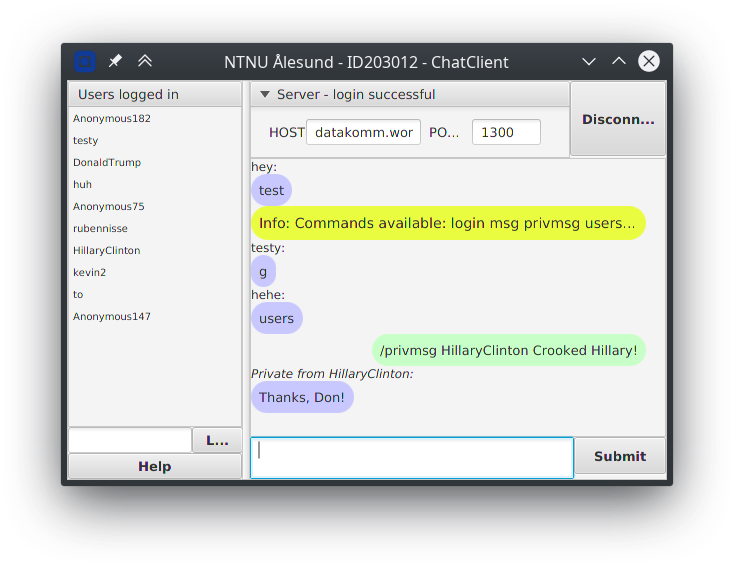
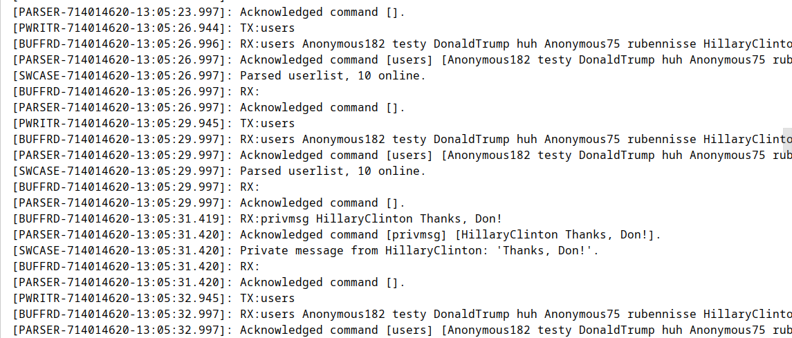

# Assignment A4 
_In this assignment we got the task to implement the TCP connection handling
for a predefined chat application._
	
__The assignment consists of two parts:__

 *  Warmup
 *  Server/client-chat appliction

## Notes
Unfortunatley I ran a rebase of the develop branch, without knowing what
it really did, so I lost all the __merge__-commits for the _git-flow_ 
function branches. Luckly no other changes were lost! I have now learned
the hard way to really read up on what the different commands do.

The completed assignment with the mandatory steps have been _tagged_ with __v1.0.0__.
## Release summary
### v1.0.0 - Mandatory steps
 1. Connection setup  
 1. Logic to transmit commands & public message
 1. Logon with username & parser to read incoming commands 
 1. Connection handling (disconnect) & notifying logic to listeners
 1. Parse list of online users & notify listeners
 1. Transmit private messages
 1. Receive incoming messages
 1. Parse & show supported server commands
 1. Final bugfixes & testing before release
 1. Release v1.0.0 to production

## Screenshots
#### The client GUI

_Shows a private meassage exchange_
### The debug terminal

_The terminal shows responsible method, socket id, timestamp and debug info_ 

